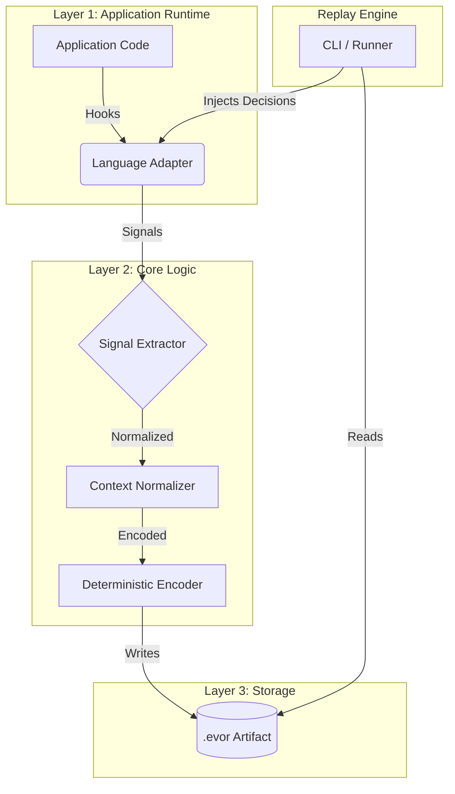
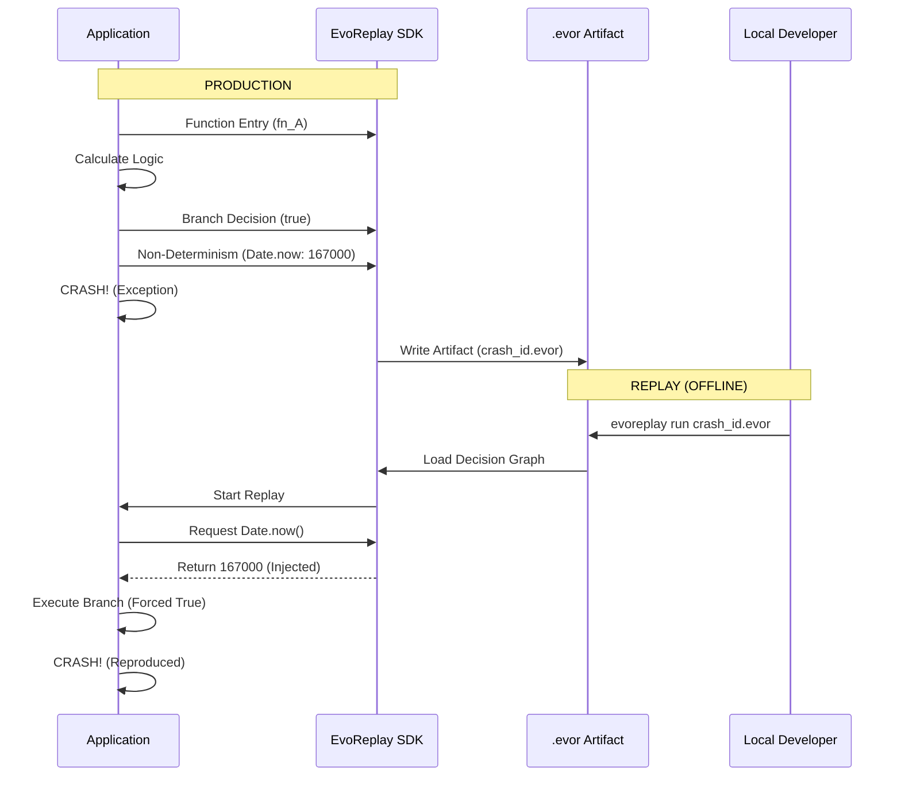

# EvoReplay

> **We do not replay machines. We replay decisions.**

EvoReplay is a production-grade, deterministic execution replay system designed to reproduce ephemeral bugs exactly as they occurred. It captures the minimal "decision graph" required to force code to take the same path during replay, without relying on heavy logs or memory dumps.

[](https://opensource.org/licenses/MIT)

##  System Architecture

EvoReplay follows a strict 3-Layer Architecture to ensure language agnostic behavior.



##  Workflow Diagram

How EvoReplay captures a bug in production and replays it locally.



## 🚀 Getting Started

Select your language to view specific documentation:

### [Node.js SDK](./sdk/node/README.md)
Reference implementation for JavaScript/TypeScript runtimes.
- **Package**: `evoreplay-node`
- **Features**: Automatic Time/Random hooks.

### [Go SDK](./sdk/go/README.md)
Infrastructure-grade SDK for Go services.
- **Package**: `github.com/evoreplay/go-sdk`
- **Features**: High-performance thread-safe recorder.

##  Repository Structure

```text
.
├── sdk/
│   ├── node/          # Reference Node.js Implementation
│   └── go/            # Infrastructure-Grade Go Implementation
├── schemas/
│   └── artifact.schema.json  # Strict .evor Spec
└── API_SPECIFICATION.md
```

##  License

This project is licensed under the MIT License - see the [LICENSE](LICENSE) file for details.
