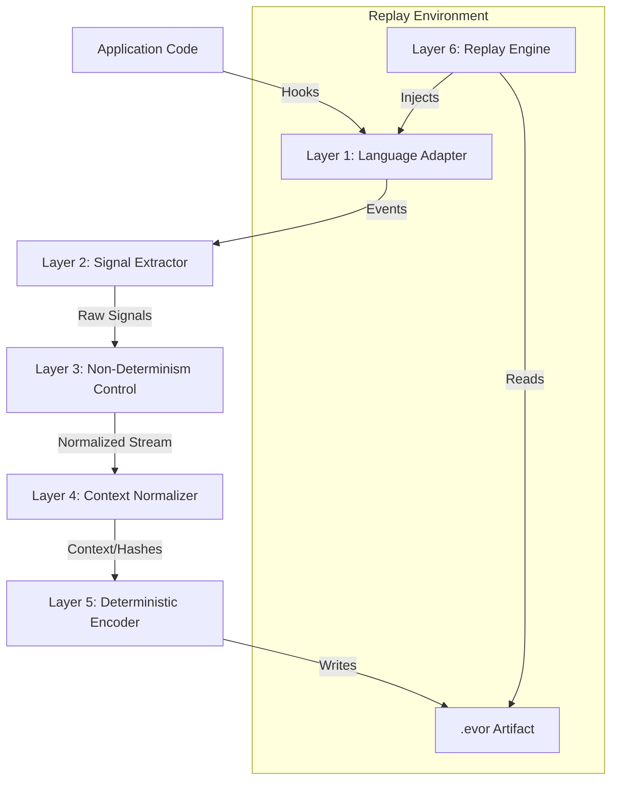

# EvoReplay System Architecture

## 1. Core Philosophy
> "We do not replay machines. We replay decisions."

EvoReplay is a **deterministic execution replay system** designed to reproduce production failures by capturing the minimal set of decisions required to force the same code path to execute locally. It is **not** a traditional record-and-replay debugger that captures full memory or disk state.

### 1.1 Non-Goals
- **No Full Memory Dumps**: We do not capture heap snapshots or stack contents unrelated to control flow.
- **No Raw PII Capture**: Data is hashed, redacted, or structurally fingerprint-ed by default.
- **No Live Code Mutation**: We do not instrument code at runtime via bytecode injection if it compromises stability.
- **No "Record Everything"**: Only non-deterministic boundaries are recorded.
- **No Online Dependency**: Replay must happen completely offline.

## 2. High-Level Architecture

The system is composed of 6 distinct layers, flowing from the application runtime down to the storage artifact and back up through the replay engine.



## 3. Layer Detail

### Layer 1: Language Adapters (The "Thin" Layer)
*Objective: Intercept control flow without overhead.*

Adapters are language-specific libraries (e.g., `evoreplay-node`, `evoreplay-go`) that sit inside the host process.
- **Responsibility**: 
    - Hook function entry/exit points (where possible/configured).
    - Intercept specific "sources of non-determinism" (I/O, Time, Random).
    - **Constraint**: Must add < 5% CPU/Memory overhead.
    - **Mechanism**: varies by language (e.g., `Proxy` in JS, `instrumentation` packages in Go, `JVMTI` agents in Java).

### Layer 2: Execution Signal Extraction
*Objective: Convert runtime behavior into discrete events.*

We do not record *data*, we record *signals*.
- **Signal Definition**: A tuple representing a decision point.
  ```json
  {
    "type": "BRANCH_DECISION",
    "loc": "func_auth_validator:42",
    "val": true, // User was authorized
    "ts_delta": 4 // Microseconds since last signal
  }
  ```
- **Key Signals**: `FunctionEntry`, `FunctionExit`, `BranchTaken`, `Exception`, `AsyncSchedule`, `TimeQuery`, `RandomGen`.

### Layer 3: Non-Determinism Control
*Objective: Tame the chaos.*

This layer identifies calls that yield different results on different runs and neutralizes them.
1.  **Time**: Intercepts `Date.now()`. During recording, passes through but logs value. During replay, returns recorded value.
2.  **Randomness**: Seeds or mocks RNGs.
3.  **Concurrency**: Records the *order* of async completions or thread locks to enforce the same interleaving during replay.
4.  **I/O**: Records the *hash* and *structure* of external inputs (DB results, API responses), not necessarily the full raw payload unless explicitly allowed.

### Layer 4: Context Normalization
*Objective: Make the recording strictly about logic, not environment.*

- **Stack Traces**: Converted to relative frames (Function X called Function Y) rather than absolute memory addresses or file paths.
- **Objects/State**: Converted to structural hashes. If an object `{a: 1, b: 2}` causes a crash, we record "Object with keys [a, b]", not necessarily the values unless they drive a control flow decision that cannot be inferred.
- **Errors**: Semantic fingerprints (Error Type + Message Hash) to group identical bugs.

### Layer 5: Deterministic Encoder
*Objective: Persist the knowledge.*

Encodes the stream of signals into the `.evor` artifact.
- **Format**: Binary, compressed, append-only during recording.
- **Sections**:
    - **Header**: Version, Timestamp, Arch, Language SDK Version.
    - **Determinism Map**: The recorded values for Time, Random, etc.
    - **Decision Table**: Bitset or RLE (Run-Length Encoded) stream of booleans for branches.
    - **Dependency Snapshots**: Mock data for external APIs (hashed/redacted).
    - **Signature**: Cryptographic signature for integrity.

### Layer 6: Replay Engine
*Objective: The Time Machine.*

The engine reads an `.evor` file and drives the Language Adapter in "Replay Mode".
- **Mechanism**:
    - Starts the application in a "paused" state.
    - Injects the recorded "Determinism Map" into Layer 3.
    - As code executes, Layer 1 asks the Engine: "Which branch did I take here last time?" or "What time is it?".
    - The Engine answers effectively forcing the code to walk the exact same path.
- **Modes**:
    - **Full Replay**: Run until end or crash.
    - **Assertion Replay**: Run to a specific point and check state.
    - **Differential**: Run version A and version B with the same `.evor` input to see divergence.
